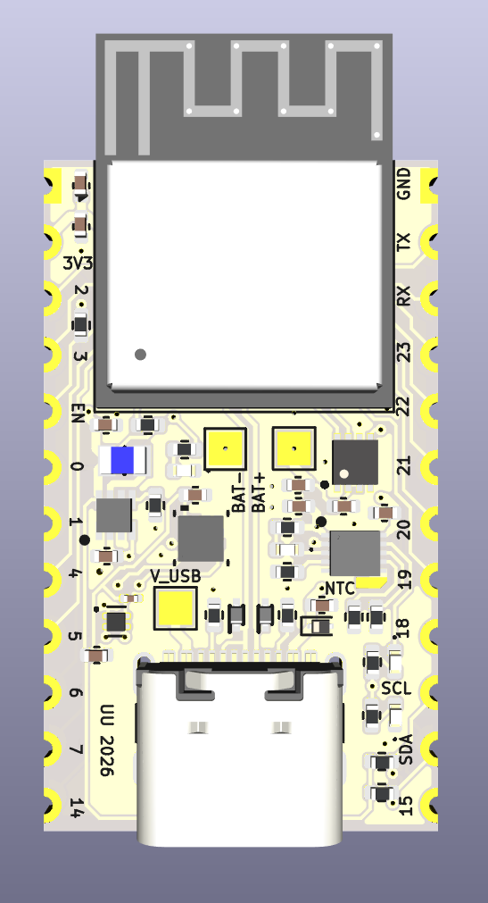
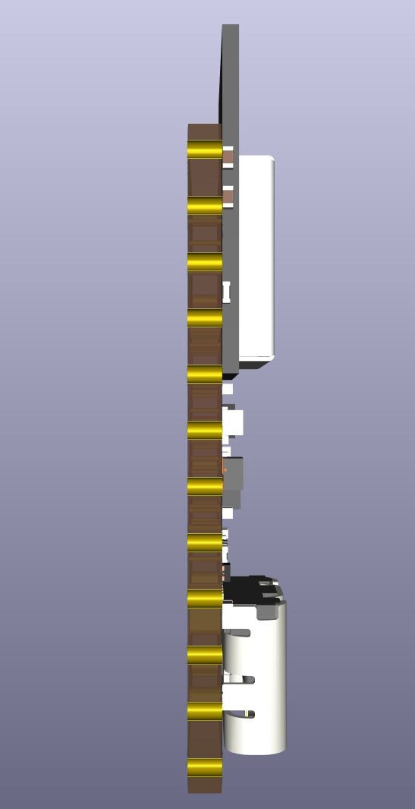
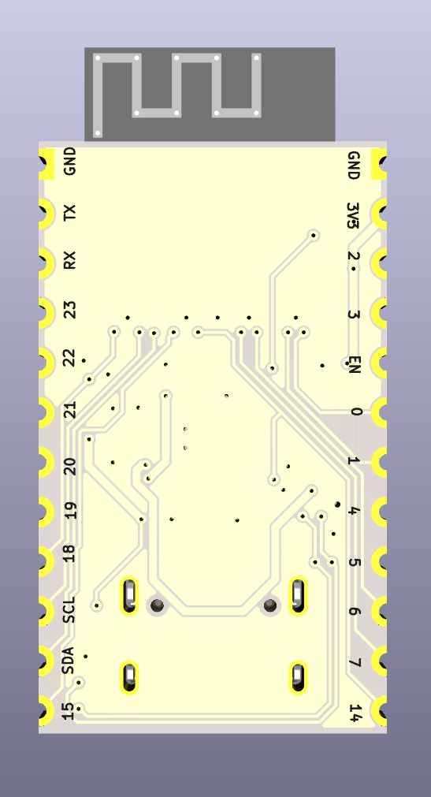
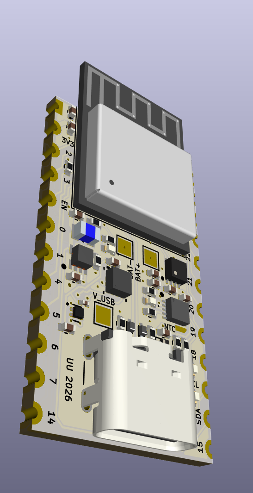
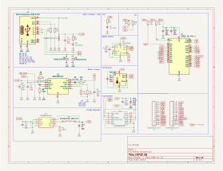
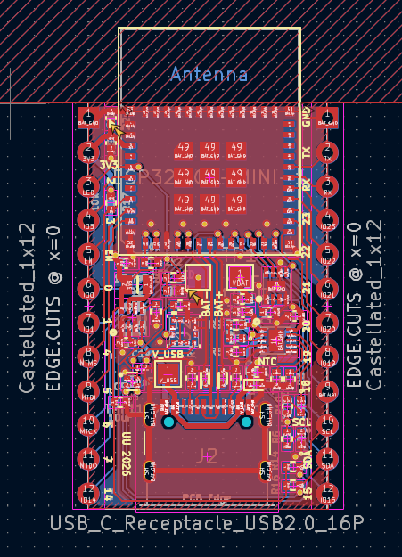

## ESP32-C6-MINI-1

Size 17.8 x 35.75  mm

- ESP32-C6-MINI-1 module ,main [MCU](ESP32-C6/assets/esp32-c6-mini-1_mini-1u_datasheet_en.pdf) $I_q = 8 \mu A$ 
- BQ25185DLHR [Battery Management / Charger](ESP32-C6/assets/bq25185.pdf) $I_q = 4 \mu A$ (might want to replace with BQ25638 sometime in future)
- TPS62840DLRC 3.3V step-down [Voltage Regulator](ESP32-C6/assets/tps62840.pdf) $I_q = 60nA $
- MAX17048 LiPo [fuel gauge](ESP32-C6/assets/max17048-max17049.pdf) $I_q = 0.5 \mu A$ (would no longer be need if BQ25638 is used)
- TMP110D digital temperature sensor, [TMP110D temperature sensor](ESP32-C6/assets/tmp110.pdf) $I_q = 0.15 \mu A$
- LIS2DW12 [acceleromter](ESP32-C6/assets/lis2dw12.pdf) $I_q = 50 nA$hundred
- USB4105 (USB-C receptacle) (datasheet not added yet) + ESD protection (ESD9B5.0ST5G)
- Castellated edge connectors

### Bill of Materials
- [BOM ESP32 C6 MINI 1](ESP32-C6/BOM.xlsx)

### Design Materials
<table>
  <tr>
    <td></td>
    <td></td>
    <td></td>
    <td></td>    
  </tr>
</table>

