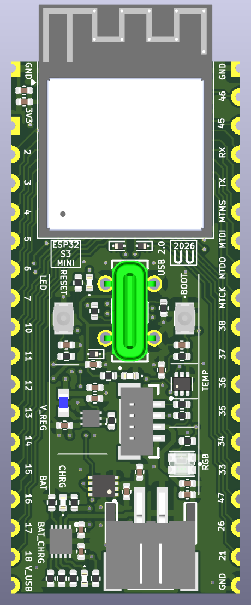
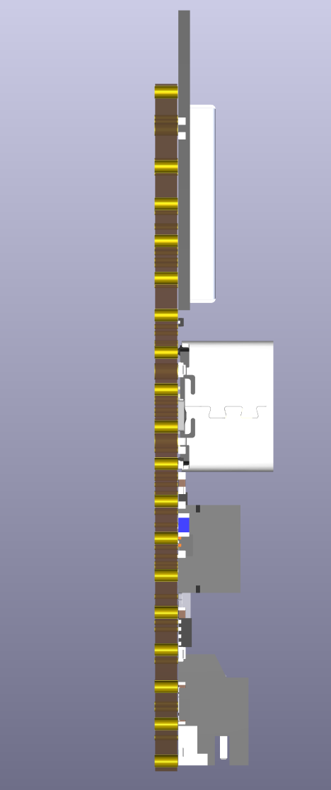
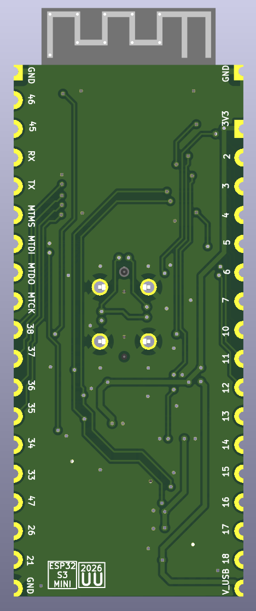
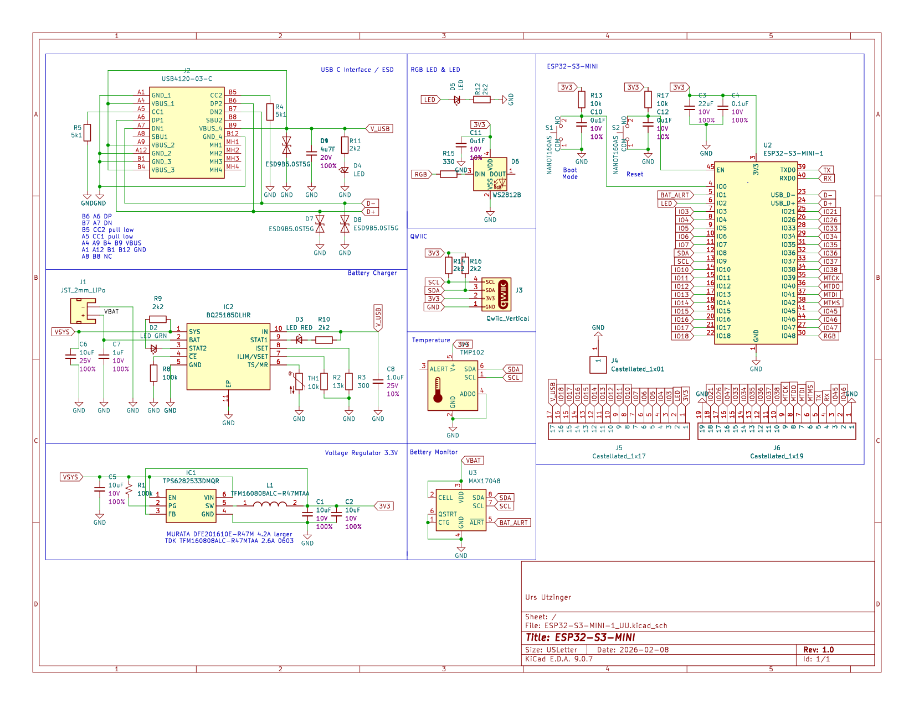
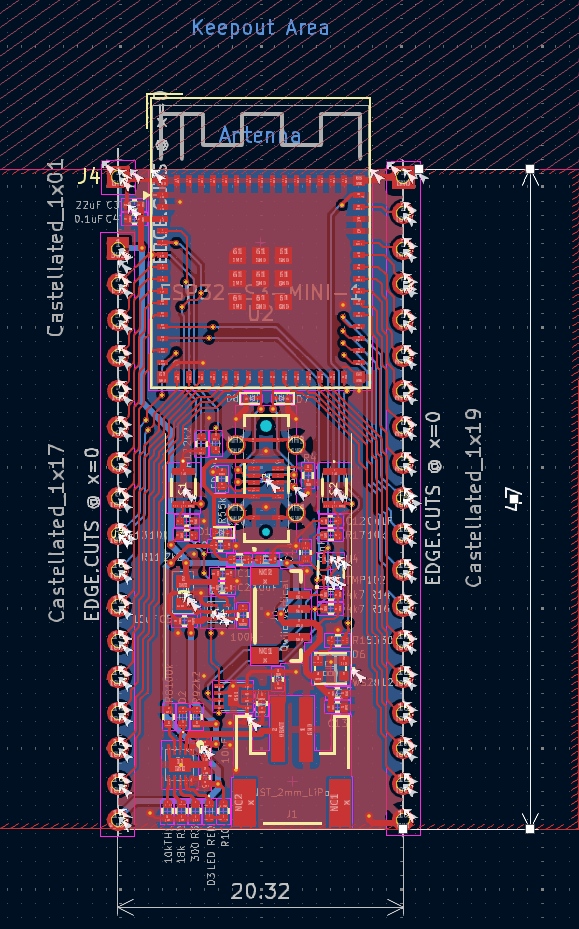

# ESP32_PCB

Designed with KiCad.

## ESP32-S3-MINI

Size 20.32 x 47 mm

- ESP32-S3-MINI-1 module ,main [MCU](ESP32_S3_MINI/datasheets/esp32-s3-mini-1_mini-1u_datasheet_en.pdf)
- BQ25185DLHR [Battery Management / Cahrger](ESP32_S3_MINI/datasheets/bq25185.pdf)
- TPS6282533DMQR 3.3V step-down [Voltage Regulator](ESP32_S3_MINI/datasheets/tps62825.pdf)
- MAX17048 LiPo [fuel gauge](ESP32_S3_MINI/datasheets/MAX17048_MAX17049.pdf)
- TMP102 digital temperature sensor, [TMP102 temperature sensor](ESP32_S3_MINI/datasheets/TMP102.pdf)
- USB4120-03-C (USB-C receptacle)[ESP32_S3_MINI/USB4120-03-C USB-C receptacle](ESP32_S3_MINI/datasheets/USB4120-03-C.pdf) + ESD protection (ESD9B5.0ST5G)
- WS2812B 2020 RGB LED [WS2812B 2020 RGB LED](ESP32_S3_MINI/datasheets/WS2812B-2020.pdf), + discrete status LEDs (green/red), 
- Qwiic JST-SH 1.0mm 4-pin connector (I2C), [JST SH 1.0mm (Qwiic)](ESP32_S3_MINI/datasheets/JST_SH_1.0mm.pdf)
- JST 2.0mm 2-pin LiPo battery connector, [JST PH 2.0mm (LiPo)](ESP32_S3_MINI/datasheets/JST_PH_2.0mm.pdf)
- Power stage [TFM160808ALC-R47MTAA inductor](ESP32_S3_MINI/datasheets/TFM160808ALC.pdf)
- Tactile buttons (NANOT160AS) [Buttons](ESP32_S3_MINI//datasheets/nanot.pdf)
- Castellated edge connectors

<table>
  <tr>
    <td></td>
    <td></td>
    <td></td>
  </tr>
</table>

