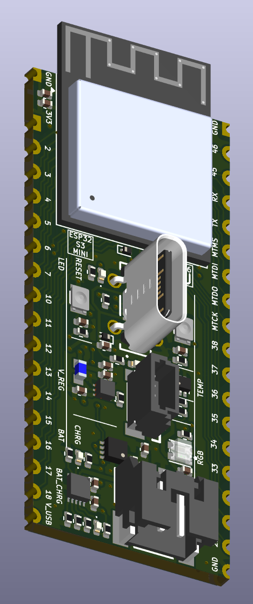
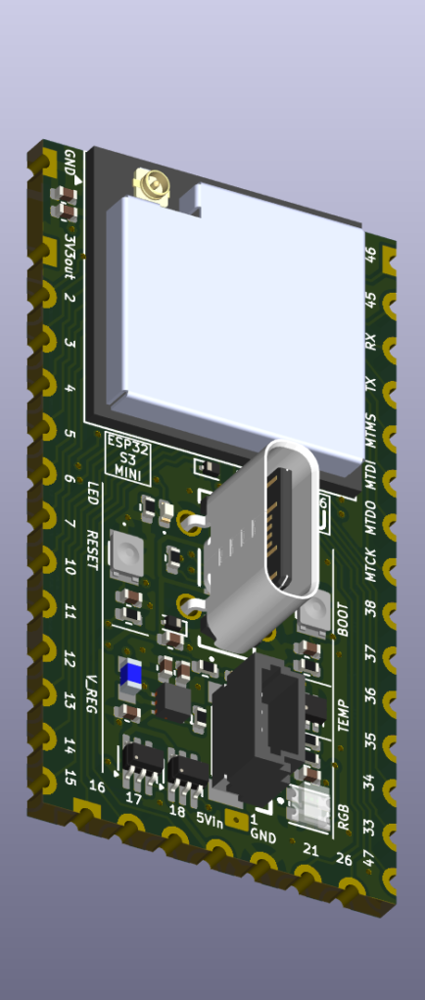
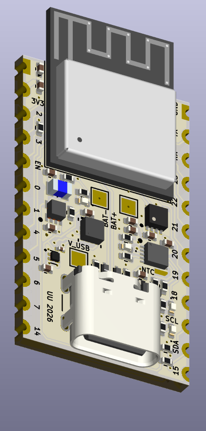

# ESP32 PCBs

Designed with KiCad by Urs Utzinger, February - June 2026.

- Full size battery operated ESP32-S3-Mini
- Minimial size ESP32-S3.
- Minimal size ESP32-C6, low power.

Based on S3/C6-mini modules.

<table style="width:100%; table-layout:fixed;">
  <tr>
    <td valign="bottom" style="width:33.3%; text-align:center;">
      
       
      <b>ESP32-S3-MINI-1</b>
      <ul style="text-align:left; margin:8px auto; max-width:90%; list-style:none; padding-left:0;">
        <li>📡 Antenna</li>
        <li>🔋 Battery management</li>
        <li>📊 Battery gauge</li>
        <li>⚡ Dual supply power (ext 5V or USB 5V) </li>
        <li>⇄ USB-C</li>
        <li>🔗 QWIIC</li>
        <li>🌈 RGB LED</li>
        <li>🌡 Temperature sensor</li>
        <li>🔘 Bootmode, Reset buttons</li>
      </ul>
    </td>
    <td valign="top" style="width:33.3%; text-align:center;">
      
       
      <b>ESP32-S3-MINI-1U</b>
      <ul style="text-align:left; margin:8px auto; max-width:90%; list-style:none; padding-left:0;">
        <li>⚡ Dual supply power (external 5V or USB 5V)</li>
        <li>⇄ USB-C</li>
        <li>🔗 QWIIC</li>
        <li>🌈 RGB LED</li>
        <li>🌡 Temperature sensor</li>
        <li>🔘 Bootmode, Reset buttons</li>
      </ul>
    </td>
    <td valign="top" style="width:33.3%; text-align:center;">
      
       
      <b>ESP32-C6-MINI-1</b>
      <ul style="text-align:left; margin:8px auto; max-width:90%; list-style:none; padding-left:0;">
        <li>📡 Antenna</li>
        <li>🔋 Battery management</li>
        <li>📊 Battery gauge</li>
        <li>⇄ USB-C</li>
        <li>🌡 Temperature sensor</li>
        <li>🫨 Acceleromter</li>
        <li>no Buttons
      </ul>
    </td>
  </tr>
</table>

